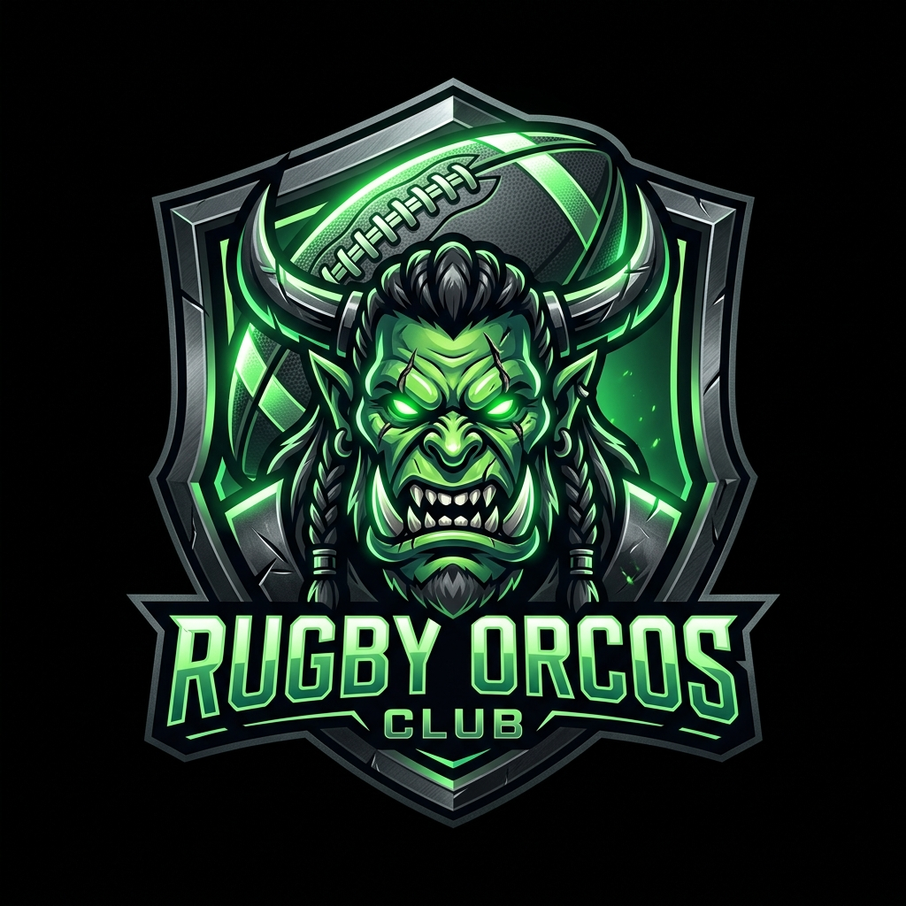

# RUGBY ORCOS NEGROS — Reino Manager v4.0

<p align="center">
  
</p>

Aplicacion Web Progresiva (PWA) para la gestion integral del club de rugby **Orcos Negros**. Tematica RPG de fantasia epica con roles, torneos, entrenamientos, finanzas y mas.

---

## Stack Tecnologico

| Categoria | Tecnologia |
|-----------|-----------|
| Frontend | React 18 + Vite 4 |
| Backend | **Supabase** (PostgreSQL, Auth, API, RLS) |
| Auth | Email/Password + Username para Guerreros |
| Mobile | Capacitor (Android APK) + PWA (iOS Safari) |
| IA | Gemini / Groq / DeepSeek (multi-provider) |
| Estilos | CSS puro con Custom Properties (glassmorphism + neon) |
| Deploy | Vercel (frontend) + Supabase Cloud (backend) |
| Code Analysis | **CodeGraph** (tree-sitter knowledge graph) |

---

## Estructura del Proyecto

```
Rugby Orcos/
├── src/
│   ├── main.jsx                 # Entry point
│   ├── App.jsx                  # Header, tabs, navegacion, admin panel
│   ├── index.css                # Design system (neon, glassmorphism, variables)
│   ├── supabaseClient.js        # Cliente Supabase
│   ├── context/
│   │   ├── AuthContext.jsx      # Autenticacion (login, signup, perfil, roles)
│   │   ├── ClubContext.jsx      # Estado global, CRUD, permisos, sync Supabase
│   │   └── ToastContext.jsx     # Notificaciones toast
│   ├── components/
│   │   ├── Login.jsx            # Login unificado (email/username + password)
│   │   ├── Dashboard.jsx        # Panel principal (metricas, HIA, Sin-Bin, wellness)
│   │   ├── Roster.jsx           # CRUD jugadores, atributos RPG, insignias, credenciales
│   │   ├── CanchaTactica.jsx    # Pizarra con 11 formaciones + drag-and-drop
│   │   ├── Tribunal.jsx         # Asistencia, infracciones, rankings
│   │   ├── Calendario.jsx       # Agenda, fixtures, match center, rivals
│   │   ├── Finanzas.jsx         # Caja chica, membresias, inventario
│   │   ├── TrainingHub.jsx      # Plan inteligente, rutinas, catalogo
│   │   ├── AIChat.jsx           # Chat tactico multi-proveedor IA
│   │   ├── AwardsHall.jsx       # Salon de la Fama (43 premios + certificados)
│   │   ├── MakgoraHub.jsx       # Torneo Mak'Gora (equipos, fixture, standings)
│   │   ├── PlayerDashboard.jsx  # Vista personal del Guerrero
│   │   ├── UserManagement.jsx   # Admin de usuarios, roles y reset password
│   │   ├── Settings.jsx         # Configuracion IA
│   │   ├── Rivales.jsx          # Gestion de equipos rivales
│   │   ├── AuthCallback.jsx     # Callback de autenticacion
│   │   ├── ErrorBoundary.jsx    # Captura de errores React
│   │   └── Toast.jsx            # Componente toast
│   ├── data/
│   │   ├── supabaseApi.js       # Capa API Supabase + conversor de datos
│   │   ├── exerciseLibrary.js   # 44 ejercicios de rugby
│   │   └── faultExerciseMap.js  # Mapa fallos → ejercicios correctivos
│   └── engine/
│       ├── assignmentEngine.js  # Motor de reglas para planes de entrenamiento
│       ├── aiProvider.js        # Router multi-proveedor IA
│       └── providers/           # Gemini, Groq, DeepSeek, OpenAI Compatible
├── supabase/migrations/
│   ├── 00_reset_db.sql          # Destruye todo
│   ├── 01_schema_v4.sql         # Schema limpio (27 tablas + RLS + funciones)
│   ├── 02_fix_user_profiles_rls.sql  # Deshabilita RLS en user_profiles
│   └── 03_admin_reset_staff_password.sql  # RPC para resetear password staff
├── seed/seed-csv.mjs            # Importador CSV → Supabase
├── public/
│   ├── manifest.json            # PWA manifest
│   └── sw.js                    # Service Worker (offline)
├── android/                     # Proyecto Android Capacitor
├── vercel.json                  # Config SPA fallback para Vercel
├── capacitor.config.json        # Config Capacitor Android
└── .env                         # Variables de entorno (NO COMMITEAR)
```

---

## Roles RPG — Jerarquia del Reino

| Tier | Rol Sistema | Rol RPG | Icono | Permisos |
|:----:|------------|---------|:-----:|----------|
| 0 | Desarrollador | Arquitecto del Reino | 🏰 | Todo el sistema |
| 1 | Presidente | Senor de la Guerra | ⚔️ | Todos los clubes, crear usuarios |
| 2 | Promotor | Comandante de Horda | 🛡️ | Su club completo |
| 3 | Entrenador | Maestro de Armas | 🏋️ | Entrenamientos, roster, tactica |
| 3 | Tesorero | Guardian del Botin | 💰 | Finanzas, membresias |
| 3 | Arbitro | Juez del Coliseo | ⚖️ | Tribunal, disciplina |
| 4 | Jugador | Guerrero | 👹 | Solo su perfil personal |

---

## Flujo de Login

### Staff (Arquitecto, Senor, Comandante, Maestro, Guardian, Juez)
- Ingresa su **email** + contrasena → Supabase Auth → accede al panel completo segun permisos

### Guerrero (Jugador)
- Ingresa su **nombre de usuario** (ej: `freyder.andres`) + contrasena
- La app busca el username en `players`, obtiene su email interno → login
- Accede a su **PlayerDashboard** personal (atributos, insignias, wellness)

### Fundar Reino (primer uso / staff nuevo)
- Admin > Miembros > crear usuario con email + password + rol

---

## Modulos

### Dashboard
Metricas del squad, protocolo HIA (conmociones), temporizador Sin-Bin, wellness check-in, eventos, partidos recientes.

### Roster
CRUD de jugadores con atributos RPG (Fuerza, Velocidad, Resistencia, Tecnica). Historial fisico SVG. Lesiones 4 fases. Gimnasio 1RM. Insignias automaticas. **Forjar Credenciales** (genera username + password). **Restablecer Contrasena** de jugador.

### Pizarra Tactica
11 formaciones, drag-and-drop, asignacion de jugadores, banco de suplentes, orientacion H/V, 3 tamanos.

### Tribunal Disciplinario
Asistencia con penitencias (burpees, conos). Infracciones. Rankings: Honor, MVPs, Tries, Tackles.

### Salon de la Fama
**43 premios automaticos** basados en estadisticas (15 de Honor + 28 de la Taberna). Certificados HTML imprimibles.

### Mak'Gora
Torneo interno con 6 equipos. Crear torneos, fixture round-robin, registrar resultados, tabla de posiciones (puntos bonus). Historial de campeones.

### Agenda
Eventos con recurrencia. WhatsApp formatter. Fixture y resultados. Match Center. Equipos rivales.

### Finanzas
Caja chica, membresias con abonos parciales ($10,000 COP), inventario con custodios.

### Entrenamientos
Plan inteligente (motor de reglas + IA). 13 rutinas. 44 ejercicios. Calculo de cargas 1RM.

### IA Coach
Chat multi-proveedor (Gemini/Groq/DeepSeek) con failover. 3 modos. Rate limit y cache.

---

## Credenciales de Prueba

| Rol | Usuario | Contrasena |
|-----|---------|-----------|
| Arquitecto del Reino | admin@orcosnegros.com | OrcosAdmin2026! |

---

## CodeGraph

El proyecto incluye **CodeGraph**, un knowledge graph basado en tree-sitter que indexa todos los simbolos, referencias y flujos del codigo. Util para analisis estructural en lugar de grep.

| Consulta | Herramienta |
|----------|------------|
| "Donde se define X?" | `codegraph_search` |
| "Que llama a la funcion Y?" | `codegraph_callers` |
| "Que llama Y?" | `codegraph_callees` |
| "Como llega X a Y?" | `codegraph_trace` |
| "Que romperia si cambio Z?" | `codegraph_impact` |
| "Dame el source de Y" | `codegraph_node` |

```bash
codegraph init -i
```

---

## Setup Local

```bash
git clone https://github.com/kentarodva/RugbyOrcos.git
cd "Rugby Orcos"
npm install
# Crear .env con:
#   VITE_SUPABASE_URL=https://qtvmqlbjcotvbzuwanjs.supabase.co
#   VITE_SUPABASE_ANON_KEY=eyJ...
#   SUPABASE_SERVICE_ROLE_KEY=eyJ...
npm run dev   # http://localhost:3000
```

### Setup Supabase (primera vez)

1. Crear proyecto en [supabase.com](https://supabase.com)
2. SQL Editor > ejecutar en orden:
   - `supabase/migrations/00_reset_db.sql` (solo si hay que limpiar)
   - `supabase/migrations/01_schema_v4.sql`
   - `supabase/migrations/02_fix_user_profiles_rls.sql`
   - `supabase/migrations/03_admin_reset_staff_password.sql`
3. `node seed/seed-csv.mjs "ruta/al/archivo.csv"`
4. Authentication > Providers > Email: habilitado

### Setup Vercel

1. Conectar repo `kentarodva/RugbyOrcos`
2. Environment Variables: `VITE_SUPABASE_URL` + `VITE_SUPABASE_ANON_KEY`

---

## Scripts

| Comando | Descripcion |
|---------|-------------|
| `npm run dev` | Dev server localhost:3000 |
| `npm run build` | Build produccion en dist/ |
| `npm run lint` | ESLint (0 warnings) |
| `npm run cap:sync` | Sincronizar Android |
| `npm run cap:open-android` | Abrir Android Studio |
| `node seed/seed-csv.mjs ruta.csv` | Importar CSV a Supabase |

---

## Estado del Proyecto

| Fase | Tarea | Estado |
|:----:|-------|:------:|
| 0 | Preparacion (Supabase, Vercel, Git) | ✅ |
| 1 | Schema SQL limpio (27 tablas + RLS + funciones) | ✅ |
| 2 | Auth email/password + Login unificado + Fundar Reino | ✅ |
| 3 | Roles RPG + Permisos + UserManagement | ✅ |
| 4 | Acceso Guerreros + PlayerDashboard + Forjar Credenciales | ✅ |
| 5 | Salon de la Fama (43 premios + certificados) | ✅ |
| 6 | Modo Mak'Gora (torneos, fixture, standings) | ✅ |
| 7 | Restablecer contrasena staff (🔑) | ✅ |
| 8 | Build APK Android | ⬜ |
| 9 | Invitacion a equipos rivales (links publicos) | ⬜ |
| 10 | Prestamos de jugadores entre equipos Mak'Gora | ⬜ |

---

### Bugs conocidos

| Bug | Estado |
|-----|--------|
| `user_profiles.user_id` no coincide con `auth.users.id` para usuarios antiguos | Arreglar con SQL manual (ver abajo) |

#### Fix para perfil roto

```sql
-- Si un usuario de UserManagement no puede loguear, reparar su perfil:
UPDATE user_profiles 
SET user_id = (SELECT id FROM auth.users WHERE email = 'el-email-del-usuario@gmail.com')
WHERE display_name = 'Nombre del usuario';
```

---

*"En el scrum y en la vida, siempre juntos. Siempre Orcos."*
